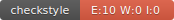

# FitDiary

> Progetto realizzato per il corso di Ingegneria Gestione ed Evoluzione del Software - Università degli Studi di Salerno 2022/23

## Partecipanti

| Project Managers                                         | Team Members                                            | Maintainers                                       |
|----------------------------------------------------------|---------------------------------------------------------|---------------------------------------------------|
| [Salvatore Fasano](https://github.com/fasanosalvatore)   | [Daniele De Marco](https://github.com/dany98sa)         | [Raffaele Sais](https://github.com/DrLele08)      |
| [Gianluca Spinelli](https://github.com/GianlucaSpinelli) | [Ilaria De Sio](https://github.com/iladesio)            | [Simone Spera](https://github.com/Everysimo)      |
|                                                          | [Rebecca Di Matteo](https://github.com/rebeccadimatteo) | [Otino Pio Santosuosso](https://github.com/Pio57) |
|                                                          | [Daniele Giaquinto](https://github.com/exSnake)         | [Aurelio Sepe](https://github.com/AurySepe)       |
|                                                          | [Davide La Gamba](https://github.com/davide-lagamba)    |
|                                                          | [Leonardo Monaco](https://github.com/lnrdmnc)           |
|                                                          | [Simone Spera](https://github.com/Everysimo)            |
|                                                          | [Antonio Trapanese](https://github.com/MastAntonio)     |

## Documentazione

* È possibile trovare la Javadoc generata nella cartella *docs*, può essere immediatamente visualizzata al seguente [link](https://fasanosalvatore.github.io/FitDiary/)

* La documentazione del processo utilizzato per la realizzazione del sistema è contenuto nella cartella *projectDocs*: all'interno ci sarà una ulteriore suddivsione in documentazione di *prodotto*, redatta dai Team Members, e documentazione di *management*, redatta dai Project Managers

* È possibile inoltre consultare il report relativo alla coverage, generato dal tool JaCoCo, nella cartella *JaCoCo-Coverage-Report*

## Guide per l'esecuzione locale

### Esecuzione Frontend

1. Entrare nella cartella frontend
2. Eseguire il comando `npm run start`

### Esecuzione Backend con Intellij IDEA

1. Apri progetto in IntelliJ IDEA
2. Esegui il progetto con la configurazione d'esecuzione di SpringBoot
3. Apri il browser al seguente link `localhost:8080`

### Esecuzione dei test

1. Apri la cartella backend
2. Esegui `./mwnw (o .\mvnw.cmd per Windows) clean test`

## Tecnologie Utilizzate

* [Java 11](https://jdk.java.net/11/)
* [React](https://it.reactjs.org/)
* [Maven](https://maven.apache.org/)
* [ChakraUI](https://chakra-ui.com/)

## Contributors

